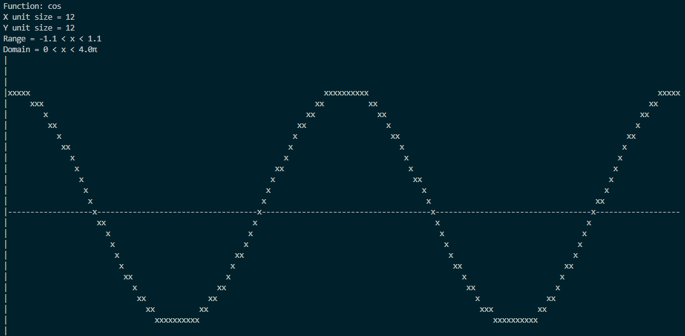

# Trigonometry Functions Console Grapher

## Overview

An adaptable command-line trig function plotting program, used to plot common trig functions (e.g. sin)



## Usage

### Build

On Linux, run:

```sh
$ gcc -o trig trig.c -lm
```

### Run

Example: 
```sh
$ ./trig -r 1 -d 3 -y 20 -x 3 -f cos
```

### Options

- `-r` &nbsp; Graph range ( -*r* < y < *r* ) *Decimal or integer*<br />
- `-d` &nbsp; Graph domain in &pi; ( 0 < x < *d*&pi; ) *Decimal or integer*<br />
- `-y` &nbsp; Graph y-unit size in characters *Integer*<br />
- `-x` &nbsp; Graph x-unit size in characters *Integer* <br />
- `-f` &nbsp; Function (sin, cos or tan) *String* <br />


## Todo

- Make plots outside of range not appear
- Make wavelength, period and translations options
- Fix rounding bugs

## Acknoledgements

Created by Nasser Kessas

## Contributing

PRs accepted, feel free to dive in! [Open an issue](https://github.com/nasserkessas/c-trig_grapher/issues/new) or submit PRs.

C Trig Grapher follows the [Contributor Covenant](http://contributor-covenant.org/version/1/3/0/) Code of Conduct.